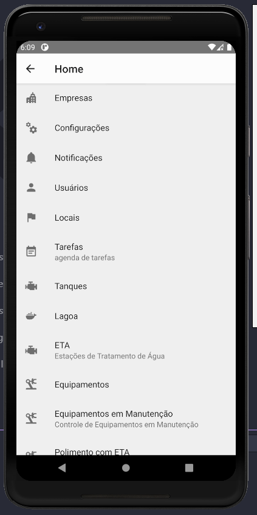
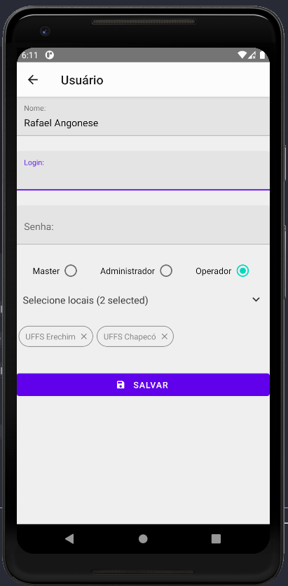
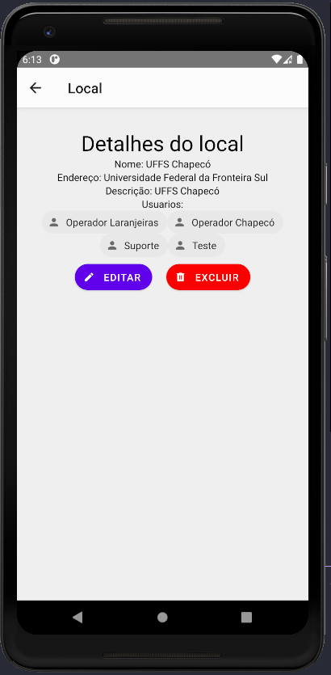

<p align="center">
  
</p>

<p align="center">
  
</p>

<p align="center">
  
</p>


## 💻 Projeto

Esse projeto foi desenvolvido durante o projeto de extensão da universidade Unochapecó em conjunto a empresa Kemia.

Este projeto é uma aplicação que consiste em fazer o gerenciamento de parâmetros de um sistema de uma empresa de tratamento de efluentes.

## ✨ Tecnologias

Esse projeto foi desenvolvido com as seguintes tecnologias:

- [React-Native-CLI](https://reactnative.dev/)

## Ambiente de desenvolvimento

Criar o arquivo .env - baseado no .env.example

```bash
react-native --version
react-native-cli: 2.0.1
react-native: 0.63.2

node --version
v12.18.3

yarn --version
1.22.4
```

## 🚀 Como executar

- Configure o ambiente React Native CLI
```bash
https://reactnative.dev/docs/environment-setup
```

- Clone o repositório
- Instale as dependências com `yarn`
```bash
yarn install
```

- Iniciar o projeto via `yarn`
```bash
yarn start
yarn android
```
- Iniciar o projeto via React-Native
```bash
npx react-native start
npx react-native run-android
```

---

- Build App

```bash
cd android && ./gradlew assembleRelease
```

- Comando uteis

```bash
adb reverse tcp:3333 tcp:3333
adb reverse tcp:8081 tcp:8081
```

```bash
cd android && ./gradlew clean
```

---

Feito com ♥ by Rafael Angonese